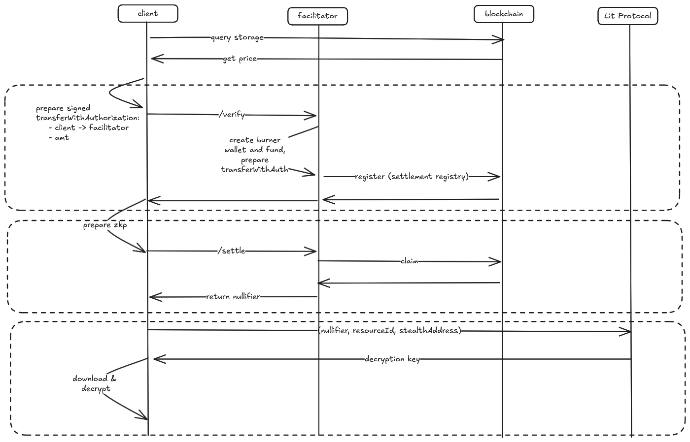

# x402f

> Trust-minimized, pay-gated data for agents. Built on [Fangorn](https://github.com/fangorn-network/fangorn).

**x402f** is a payment and access-control layer for encrypted data. It extends the [x402 protocol](https://x402.org) with a register/claim model backed by Fangorn and Semaphore ZK proofs. Buyers get **private purchases**, **private retrieval**, and **no on-chain linkage** between their identity and the resource they accessed. Sellers gain easy and verifiable programmability for their access condition, able to configure price or other conditions (like NFT ownership) for gating decryption. In addition, no party is required to support additional infrastructure, requiring no server to release data.

The semi-trusted facilitator never holds plaintext and cannot withhold data delivery after settlement. Even if the server goes offline, the buyer already has the ciphertext.

---

## Packages

| Package | Description | Readme |
|---|---|---|
| [`@fangorn-network/fetch`](./packages/fetch) | Client-side fetch wrapper. Handles payment, ZK proof generation, and local decryption | [link](./packages/fetch/README.md) |
| [`@fangorn-network/facilitator`](./packages/facilitator) | Settlement server. Registers buyers, submits proofs on-chain, returns nullifiers | [link](./packages/facilitator/README.md) |

---


## How It Works

There are four main roles within x402f.

- **The Seller** encrypts data against a *schema* using Fangorn and registers it onchains within the datasource registry and settlement registry
- **The Buyer** fetches ciphertexts from IPFS and uses the x402f fetch client to unlock them. Unlike traditional x402, the buyer must participate in two rounds of communication:
  - Phase 1: The buyer calls the facilitator's `/settle` endpoint and passes a transferWithAuthorization call that funds the facilitator itself, also passing along a commitment to their sempahore identity.
  - Phase 2: After receiving a 200 from the facilitator, the buyer uses a secret key to construct a valid proof that their identity has been registered in the semaphore group for a given resource. 
  - Phase 3: After receiving a 200 OK and a nullifier from the facilitator, attempt to use the nullifier to decrypt the content.
- **The Facilitator** is responsible for executing registrations and claims against the settlement registry, acting as a 'privacy proxy' for callers by generating ephemeral burner keys, ensuring no linkage between the caller and the actual data being consumed. At present, this is a semi-trusted, centralized server. We intent to resolve these in the future, eliminating the need for any trust against the facilitator. For more details, see the [facilitator readme](./packages/facilitator/README.md).

Ownership and access conditions are verifiable against on-chain state at every step. The facilitator is semi-trusted: it cannot read plaintext or forge decryption shares, but it does execute settlement on-chain. See [Architecture Notes](#architecture-notes).



---

## Quickstart

### Prerequisites

- Node.js 22+
- `pnpm`

### Setup

```bash
git clone https://github.com/fangorn-network/x402f
cd x402f
pnpm install

cp packages/facilitator/.env.local packages/facilitator/.env
# Fill in your details
```

### Run the facilitator

```bash
# Local, defaults to port 30333
pnpm facilitator
# Docker
docker compose up --build
```

### Run the example client

```bash
# copy env vars, fill in details
cp examples/node/.env.local examples/node/.env
pnpm run client:node
```

See the full [node example](./examples/node/).

---

## Architecture Notes

The facilitator in this release is a centralized service, similar to a standard x402 facilitator. It is the only party with full insight who can link buyer-seller-resource-price (perhaps a future point of monetization). However, it is trust-minimized in the sense that it cannot read plaintext and cannot forge identities or manipulate proofs, but settlement routing runs on a hosted server. This means that the facilitator could still succumb to a bevy of attacks or malicious behavior, such as losing network between registration and claim submission (a recoverable outage for the client and facilitator alike) or simply failing to return the nullifier. These issue will all be addressed in the near future.

---

## Related

- [Fangorn SDK](https://github.com/fangorn-network/fangorn): encrypt and publish data, manage access conditions
- [x402](https://x402.org): the HTTP payment protocol this extends
- [Coinbase x402 Facilitator docs](https://docs.cdp.coinbase.com/x402/core-concepts/facilitator):reference for the standard facilitator interface x402f extends

---

## License

MIT