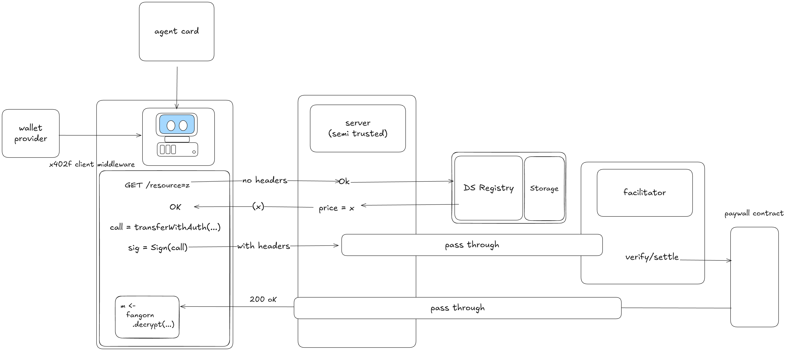

# x402f

> Pay-per-use data APIs without trusting the server.

**x402f** extends the [x402 protocol](https://x402.org) to invert the trust model entirely: the server never holds plaintext, never handles payments, and cannot withhold data — even if it goes offline.

Built on [Fangorn](https://github.com/fangorn-network/fangorn) threshold encryption, x402f enables intent-bound data delivery: content encrypted under publicly verifiable conditions, decrypted locally by the buyer only after payment is confirmed on-chain.

---

## How It Works



1. **Seller** registers a datasource and uploads encrypted content via Fangorn — no dedicated infra needed.
2. **Buyer** receives a ciphertext *before* payment. They can verify what they're purchasing against chain state.
3. **Payment** is made via x402. The facilitator verifies it and issues a decryption share.
4. **Decryption** happens locally. The server never sees plaintext, and can never withhold data post-purchase.

---

## Key Features

- **Programmable pricing** — dynamic, verifiable pricing through Fangorn, no code changes required
- **Zero seller infrastructure** — anyone can sell data without running their own server
- **Trust-minimized** — buyers start with the ciphertext; payment and ownership are verifiable on-chain
- **Censorship-resistant** — data cannot be withheld after purchase, even if the server goes offline

---

## Architecture

x402f consists of two services:

| Service | Description | Default Port |
|---|---|---|
| **Facilitator** | Verifies payments and issues decryption shares | `30333` |
| **Resource Server** | Serves encrypted data and coordinates with the facilitator | `4021` |

Both services are stateless and can be run by anyone. See the [Fangorn docs](https://github.com/fangorn-network/fangorn) to register datasources and upload content.

---

## Quickstart

### Prerequisites

- Node.js 22+
- pnpm

### Setup

```bash
# Clone and install
git clone https://github.com/fangorn-network/x402f
cd x402f
pnpm install

# Configure environment
cp .env.local .env
# Fill in your details in .env
```

### Run locally

```bash
# Start the facilitator (runs on :30333)
pnpm run facilitator

# In a separate terminal, start the resource server (runs on :4021)
pnpm run server
```

### Run with Docker

```bash
docker compose up --build
```

### Run the example client

```bash
pnpm run client:node
```

See the full [node client example](./examples/node/index.ts).

---

## For Data Consumers

- You receive the **ciphertext before payment** — verify what you're buying before spending anything
- Decryption happens **locally** after payment — the server cannot withhold your data
- Pricing and ownership are **verifiable against finalized chain state**

## For Data Sellers

- **No infrastructure required** — the shared resource server handles delivery
- **Dynamic pricing** — update prices through Fangorn without touching code or redeploying
- Optionally run a **dedicated resource server** for more control (but you don't have to)

---

## Environment Variables

| Variable | Description |
|---|---|
| `FACILITATOR_DOMAIN` | Hostname of the facilitator (e.g. `http://facilitator` in Docker, or `https://facilitator.example.com` in prod) |
| `FACILITATOR_PORT` | Port the facilitator listens on (default: `30333`) |

---

## License

MIT
<!-- # x402f 

Pay-per-use data APIs without trusting the server.

x402f is an extension of the x402 protocol that inverts the trust model: the server never holds a plaintext, never handles payments, and cannot withhold data (even if offline). 

-> See the [node client example](./examples/node/index.ts)

## Key Features

- programmable pricing with Fangorn
- universal access control server for fetching resources (no infra for sellers)
- trust-minimized

## How it Works


## Setup

First setup environment variables by running `cp .env.local .env` and filling in the details.

## Start the Facilitator

Start the facilitator first. This will run on localhost:30333

`npm run facilitator`

## Start the server

Start the resource server once the faciltiator is running. This will run on localhost:4021

`npm run server`

## Run the node client example

First install tsx with `npm install -D tsx`. Then run the example with `npm run client:node`.

For data **consumers**: 
- You *start* with a ciphertext before making a payment, which is decrypted locally. This also ensures data cannot be withheld post-purchase.
- Pricing and ownership is verifiable against the finalized chain state.

For data **sellers**:
- You do not need to support any infrastructure at all to use the solution, as it only needs one resource server. However, anybody can run their own dedicated resource server if they choose (there can be multiple, but don't need to be).
- You can dynamically price data without trusting the server or making code changes.

## Architecture

It uses [fangorn](https://github.com/fangorn-network/fangorn) for encryption and datasource registration/management. See the fangorn readme to learn how to register datasources and upload data that can be sold via x402f.

## License 

MIT  -->